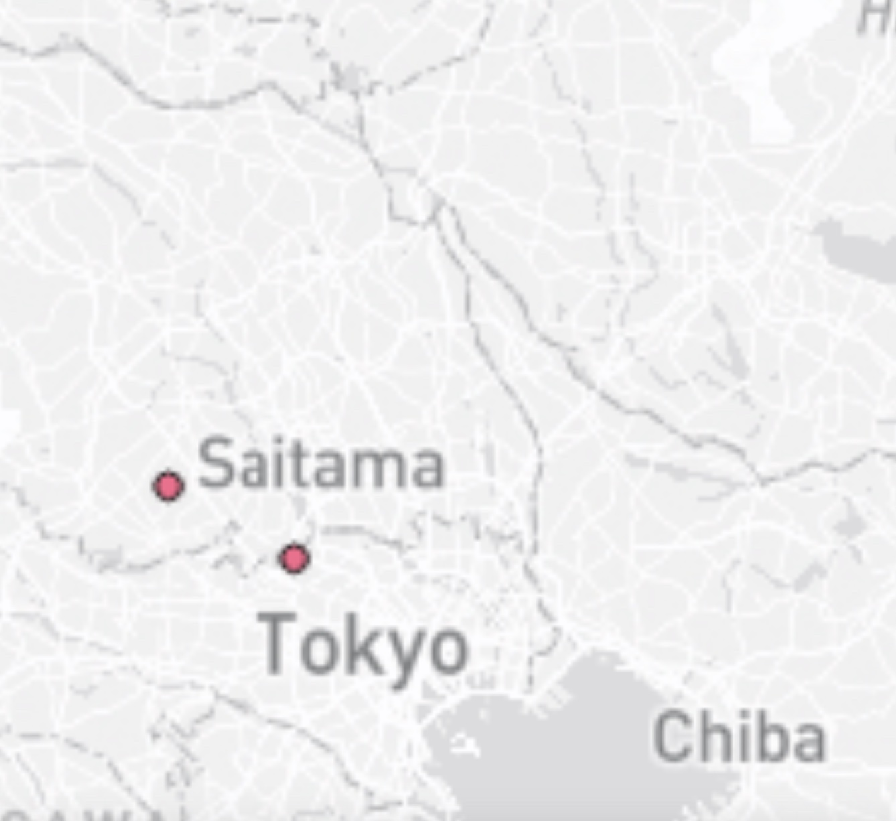

# Mapping with Tilesets

In the Mapping with Tilesets project, I developed four distinct tile maps aimed at showcasing different aspects of Japan's landscape and outdoor opportunities. Each tileset offers a unique perspective, ranging from a standard basemap to specialized maps highlighting earthquake data and nature trails across Japan. With a minimum zoom level of 3 and a maximum zoom level of 10, these tilesets provide detailed information while allowing users to explore Japan's geography with ease.

Here is the link to the website: 
## [Website Link](https://risan03-2165658.github.io/maptile_generation/)

> The first tileset features a custom basemap created by modifying colors and fonts from the default Mapbox Monochrome Style. This tailored approach enhances the visual appeal and usability of the map.

> The second titleset focuses on showcasing the earthquake incident in Japan, using the data from lab 3. 

> This tileset combines elements from the first two maps, offering users a comprehensive view of Japan's earthquake incident with a simple basemap to be easily comprehended by the users. 

> The fourth tileset is a specialized creation designed to showcase earthquake incidents in Japan, with trails highlighted in red to aid in evacuation planning. By emphasizing the path to safety during hazardous incidents, users can easily identify evacuation routes and make informed decisions. Additionally, the map displays elevation data, allowing users to assess the terrain and plan their evacuation routes accordingly, particularly in hilly areas where height levels play a crucial role in determining safe pathways.